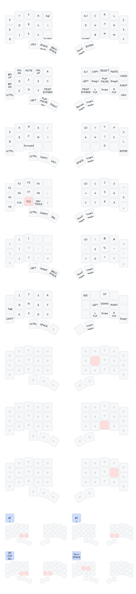

## Intro

I originally forked this repository to see if I could get it to build as a way to replace the vendor firmware for a Charybdis 3x5 I got off of AliExpress. After pinning it to an older version of ZMK, it worked. You can fork this repository, paste the contents of the [QWERTY keymaps file](https://github.com/dzhukovsky/charybdis-wireless-nano-zmk-firmware/blob/main/config/charybdis.keymap) into your own fork's Charybdis.keymap, then enable and run the actions workflow for ZMK firmware.

To enable the workflow to build the Dongle firmware, uncomment the respective section in [this file](https://github.com/dzhukovsky/charybdis-wireless-nano-zmk-firmware/blob/main/build.yaml) in your own fork. Otherwise, the workflow builds the Bluetooth firmware. 

If for whatever reason you wish to build from the repository I forked rather than this one, there should be a pull request with the respective SHA hashes you will need to replace to allow for the firmware to build.

Additionally, this repository automatically generates SVG images of all layers in the keymap, and adds it to the README. It also provides high level instructions and resources on how to customize and build the firmware to meet your specific needs.

After building, you will end up with three files:
- **Charybdis_right.uf2** - Flashes the right side
- **Charybdis_left.uf2** - Flashes the left side
- **firmware-reset-nanov2** - Reset the firmware completely

## Flashing the Firmware

Follow the steps below to flash the firmware

- If you are flashing the firmware for the first time, or if you're switching between the dongle and the Bluetooth/USB configuration, flash the reset firmware to all the devices first
- Unzip the firmware.zip
- Plug the right half info the computer through USB
- Double press the reset button
- The keyboard will mount as a removable storage device
- Copy the applicable uf2 file into the NICENANO storage device (e.g. charybdis_qwerty_dongle.uf2 -> dongle)
- It will take a few seconds, then it will unmount and restart itself.
- Repeat these steps for all devices.
- You should now be able to use your keyboard

> [!NOTE]  
> If the keyboard halves aren't connecting as expected, try pressing the reset button on both halves at the same time. If that doesn't work, follow the [ZMK Connection Issues](https://zmk.dev/docs/troubleshooting/connection-issues#acquiring-a-reset-uf2) documentation for more troubleshooting steps.

## Keymaps & Layers

Review the layer maps below to see how each one functions. Then either modify the keymap to fit your needs, or start using these defaults to become more familiar with them.

## Modify Key Mappings

### ZMK Studio

[ZMK Studio](https://zmk.studio/) allows users to update functionality during runtime. It's currently in beta, but the physical layout and updated config files are included in the BT/USB firmware for testing. The dongle firmware does not have this integration at the moment.

To change the visual layout of the keys, the physical layout must be updated. This is the charybdis-layouts.dtsi file, which handles the actual physical positions of the keys. Though they may appear to be similar, this is different than the matrix transform file (charybdis.json) which handles the electrical matrix to keymap relationship.

To easily modify the physical layout, or convert a matrix transform file, [caksoylar](https://github.com/caksoylar/zmk-physical-layout-converter) has built the [ZMK physical layouts converter](https://zmk-physical-layout-converter.streamlit.app/).

For more details on how to use ZMK Studio, refer to the [ZMK documentation](https://zmk.dev/docs/features/studio).

### Keymap GUI

Using a GUI to generate the keymap file before building the firmware is another easy way to modify the key mappings. Head over to nickcoutsos' keymap editor and follow the steps below.

- Fork/Clone this repo
- Open a new tab to the [keymap editor](https://nickcoutsos.github.io/keymap-editor/)
- Give it permission to see your repo
- Select the branch you'd like to modify
- Update the keys to match what you'd like to use on your keyboard
- Save
- Wait for the pipeline to run
- Download and flash the new firmware

### Edit Keymap Directly

To change a key layout choose a behavior you'd like to assign to a key, then choose a parameter code. This process is more clearly outlined on ZMK's [Keymaps & Behaviors](https://zmk.dev/docs/features/keymaps) page.

- Behaviors are all documented on the [Behaviors Overview](https://zmk.dev/docs/behaviors)
- Codes are all documented on the [keycodes](https://zmk.dev/docs/codes) page

Open the keymap file and change keys, or add/remove layers, then merge the changes and re-flash the keyboard with the updated firmware.

## Changing the Central and Peripheral Assignments

Follow the ZMK documentation [Kconfig.deconfig](https://zmk.dev/docs/development/new-shield#kconfigdefconfig) to change which keyboard half is the central and which is the peripheral. This does not apply to the dongle configuration.

## Changing the Keyboard Name

Follow the ZMK [Kconfig.defconfig](https://zmk.dev/docs/development/new-shield#kconfigdefconfig) section to update the keyboard name. Make sure to read about the danger in exceeding the 16 character limit.

## Building Your Own Firmware

ZMK provides a comprehensive guide to follow when creating a [New Keyboard Shield](https://zmk.dev/docs/development/new-shield). I'll touch on some of the points here, but their docs should be what you reference when you're building your own firmware.

### File Structure

When building the ZMK firmware, the files need to be located in the correct place. The formats and locations of the files can be found on ZMK's [Configuration Overview](https://zmk.dev/docs/config).

### Mapping GPIO Pins to Keys

To set up some of the configuration files it requires a knowledge of which keys connect to which pins on the MCU (see the [Shield Overlays](https://zmk.dev/docs/development/new-shield#shield-overlays) section), and how the rows and columns are wired.

To get this information, look at the PCB kcad files and follow the traces from key pads, to row and column through holes, to MCU through holes. Once you have that information you can update the applicable dtsi/overlay files.

## Creating Graphical Key Maps

This repo uses the excellent work of caksoylar's [Keymap Drawer](https://keymap-drawer.streamlit.app/) to automatically generate a key mapping of each layer when the Github Actions are run.

## Credits

- [eigatech](https://github.com/eigatech)
- [badjeff](https://github.com/badjeff)
- [inorichi](https://github.com/inorichi)
- [manna-harbour](https://github.com/manna-harbour)
- [nickcoutsos](https://github.com/nickcoutsos/keymap-editor)
- [Petejohanson](https://github.com/petejohanson)
- [caksoylar](https://github.com/caksoylar/keymap-drawer)
